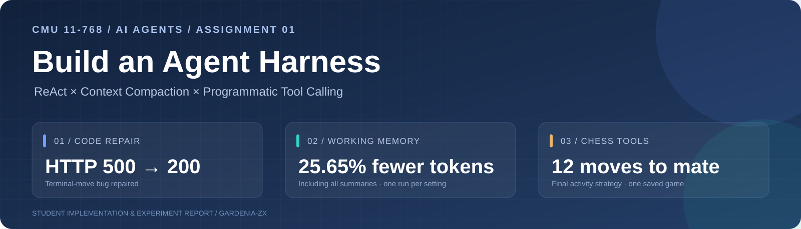
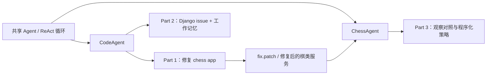
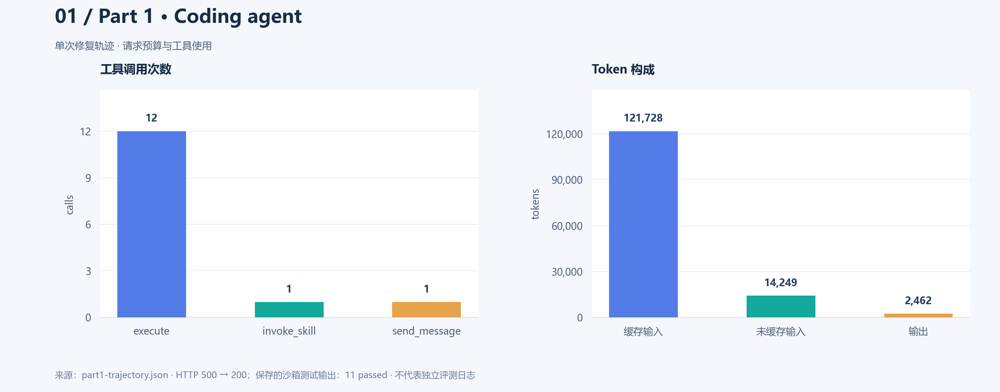
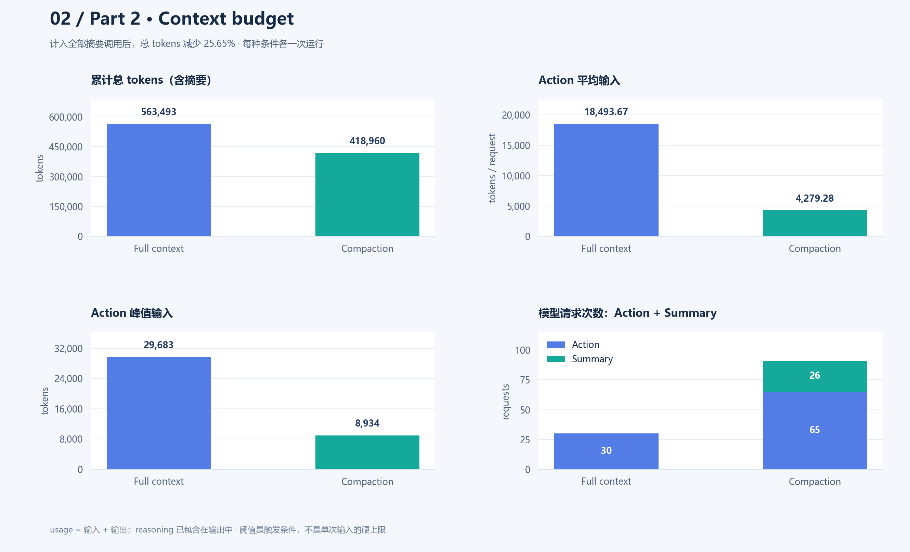
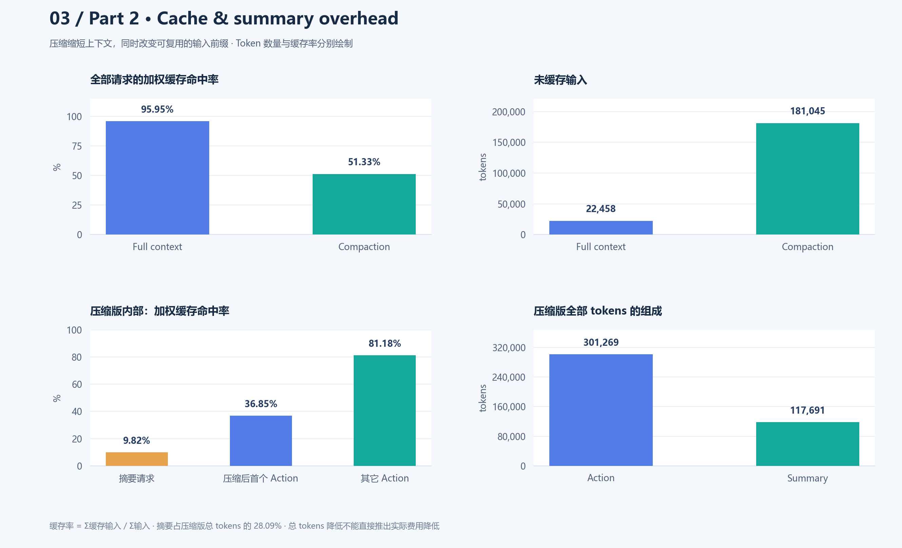
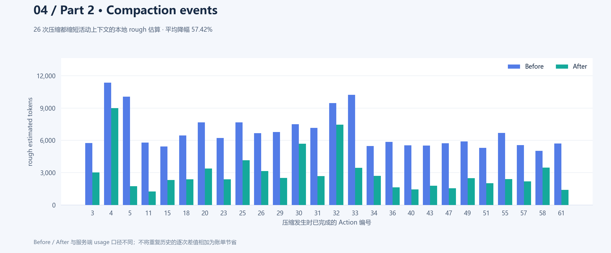
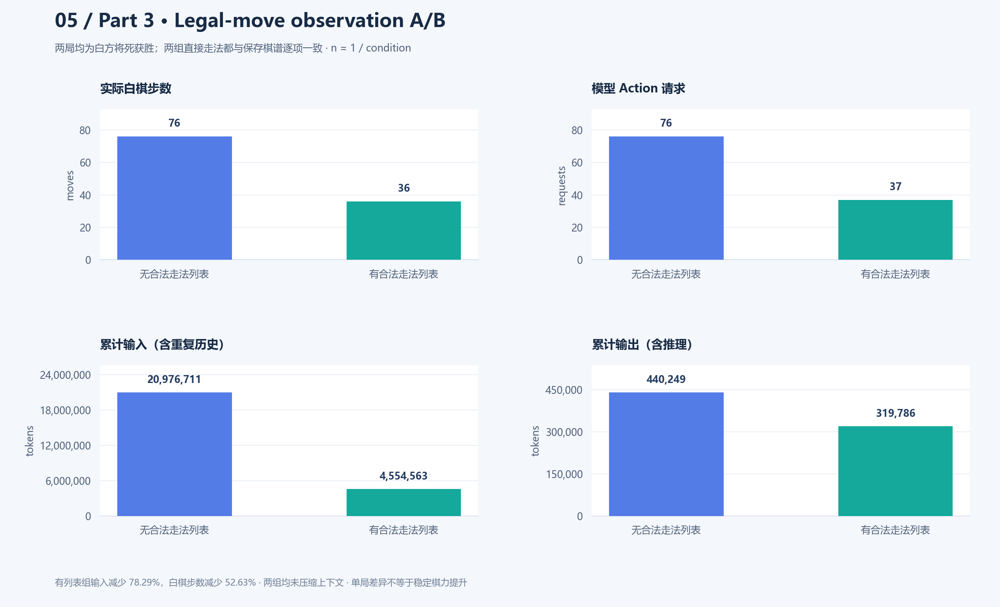
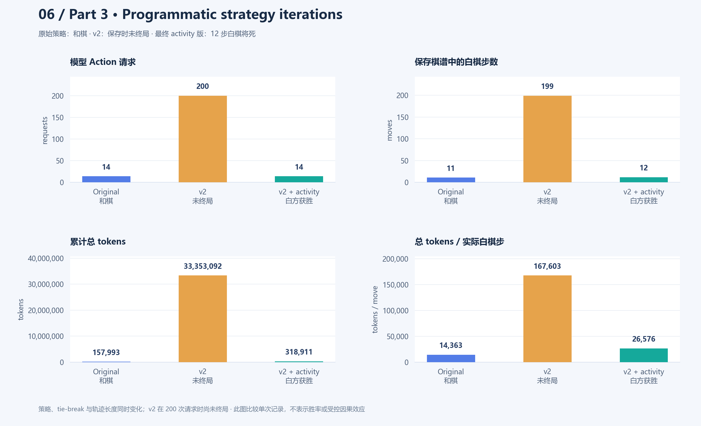

<p align="center">
  
</p>

<h1 align="center">CMU 11-768 · Assignment 1</h1>
<p align="center"><b>从代码修复到国际象棋：构建、复用与分析一个 ReAct Agent Harness</b></p>
<p align="center">
  
  
  
  
</p>
<p align="center">
  <a href="#overview">项目概览</a> · <a href="#part1">Part 1</a> · <a href="#part2">Part 2</a> · <a href="#part3">Part 3</a> · <a href="#reproduce">运行与复现</a> · <a href="#data">数据与统计口径</a>
</p>

本仓库是 Carnegie Mellon University **11-768 AI Agents** 课程 Assignment 1 的个人实现与实验记录。三个 part 共用一个 ReAct 循环：模型读取任务与历史，选择工具，接收环境观察，再继续行动。代码修复任务和棋类任务在同一框架上运行，并通过技能与工作记忆扩展能力。完整作业要求见 [ASSIGNMENT.md](ASSIGNMENT.md)。

> **结果速览**：Part 1 修复终局走子导致的 HTTP 500；Part 2 在计入摘要开销后，总 tokens 减少 **25.65%**；Part 3 最终程序化策略在保存的单局中，以 **12 步白棋、23 个半步**完成将杀。以下分析来自 **8 份已保存轨迹**，每个条件各一次运行。

<a id="overview"></a>

## 项目概览

| Part | 要解决的问题 | 实现重点 | 实验观察 |
|---|---|---|---|
| **1 · Coding Agent** | 如何让语言模型真正定位、修改并提交软件修复？ | 通用 ReAct、工具分发、技能渐进披露、补丁提交 | 14 次模型请求；保存的沙箱输出为 11 项测试通过 |
| **2 · Context Compaction** | 长轨迹如何控制活动上下文，同时保留任务进度？ | 事实性工作记忆、保留最近完整步骤、压缩事件审计 | Action 平均输入 ↓76.86%；摘要占总 tokens 的 28.09% |
| **3 · Chess Agent** | 工具观察与程序化搜索怎样影响任务完成？ | 实盘走子、无状态模拟、Python 沙箱、策略技能 | 合法走法观察 A/B + 三版程序化策略迭代 |



框架的关键设计包括：通过 `tool_call_id` 关联动作与观察；将格式错误、未知工具等问题作为可恢复观察返回；限制运行步数；在成功与失败时都保存轨迹并清理环境。技能先以名称和说明出现在系统提示中，需要时再用 `invoke_skill` 加载全文。

<a id="part1"></a>

## Part 1 · 构建 CodeAgent，修复棋类应用

### 修复了什么

任务 `chess-terminal-move` 的问题发生在白棋走出终局着法之后：棋局已经结束，代码仍调用黑棋引擎寻找下一步，最终让 `POST /api/move` 返回 **HTTP 500**。生成的补丁在调用引擎前检查 `board.outcome(claim_draw=True)`；如果已经终局，直接返回最终棋局，`engine_move` 保持为空。

保存轨迹中的复现局面为 `7k/5Q2/6K1/8/8/8/8/8 w - - 0 1`，白棋 `f7g7`（`Qg7#`）后，请求从 500 变为 **200**，返回 `game_over=true`、`status="White wins"`、`engine_move=null`。提交补丁仅修改 `src/chess_app/game.py`，见 [保存的修复补丁](reports/patches/fix.patch)。

### 最终数据

| 指标 | 保存轨迹中的数值 |
|---|---:|
| 模型 Action 请求 | 14 |
| `execute` / `invoke_skill` / `send_message` | 12 / 1 / 1 |
| 输入 / 输出 tokens | 135,977 / 2,462 |
| 总 tokens | **138,439** |
| 缓存输入 / 未缓存输入 tokens | 121,728 / 14,249 |
| 加权输入缓存命中率 | **89.52%** |
| 单次输入峰值 | 15,215 tokens |
| 保存的沙箱测试输出 | **11 passed，1 warning** |



**分析与结论。** `execute` 占全部工具调用的 **85.71%**，体现出“读代码 → 复现 → 修改 → 验证 → 提交”的实际工具工作流。输入 tokens 占总量的 **98.22%**，说明即使只有 14 步，反复携带历史也会成为主要 token 消耗。过程中一次 shell 语法错误通过工具观察返回，agent 随后继续完成任务，展示了循环的恢复能力。

这里的 **11 passed** 来自 agent 当时在原沙箱中运行的测试，其中包含其添加的回归检查；它与独立的 `make check-part1` 补丁重放评测口径不同。原数据没有保存后者的终端日志，因此这里仅报告可直接核对的修复与沙箱验证证据。

<a id="part2"></a>

## Part 2 · Context Compaction：短上下文的收益与代价

### 实验设计

两组都处理 SWE-bench 实例 **`django__django-15368`**。任务涉及 `bulk_update()` 对表达式的判断过窄；两份生成补丁均将 `isinstance(attr, Expression)` 改为检查 `resolve_expression` 接口，baseline 还删除了未使用的 `Expression` 导入。补丁可查看 [baseline](reports/patches/django__django-15368-baseline.patch) 与 [compaction](reports/patches/django__django-15368.patch)。

| 条件 | 活动历史处理 | 摘要调用 |
|---|---|---|
| **Full context baseline** | 保留完整历史；关闭压缩 | 无 |
| **Context compaction** | 6,000-token 阈值触发，旧历史替换为工作记忆 | 26 次 |

压缩时保留原始 system/task 消息，以及最近完整 assistant 动作与其关联工具观察；摘要保留目标、约束、修改、测试、失败路径和下一步。活动历史发生变化，原始 API 请求与响应继续保留，便于事后分析。

### 资源与上下文对比

| 指标 | Full context | Compaction | 本次变化 |
|---|---:|---:|---:|
| Action 请求 | 30 | 65 | 2.17 倍 |
| 摘要请求 | 0 | 26 | 额外 26 次 |
| 全部模型请求 | 30 | 91 | 3.03 倍 |
| 累计输入 tokens | 554,810 | 372,021 | **↓32.95%** |
| 累计输出 tokens | 8,683 | 46,939 | 5.41 倍 |
| 累计总 tokens，含摘要 | 563,493 | 418,960 | **↓25.65%** |
| Action 平均输入 tokens | 18,493.67 | 4,279.28 | **↓76.86%** |
| Action 峰值输入 tokens | 29,683 | 8,934 | **↓69.90%** |
| 未缓存输入 tokens | 22,458 | 181,045 | **8.06 倍** |
| 全部请求加权缓存命中率 | 95.95% | 51.33% | **↓44.62 个百分点** |



**结论一：上下文占用明显下降。** 压缩版的平均与峰值 Action 输入都显著缩短。计入所有摘要后，累计总 tokens 仍从 563,493 降为 418,960，减少 **144,533 tokens**。这一结果说明本次工作记忆机制确实控制了后续动作请求的上下文规模。

**结论二：摘要本身有明显开销。** 压缩版的 26 次摘要请求共使用 **117,691 tokens**，占全部用量的 **28.09%**。摘要输出 23,823 tokens 中，19,976 为推理 tokens（**83.85%**），所以输出数不能直接理解为可见摘要文本长度。推理 tokens 已包含在输出中，统计总量时不再重复相加。

| 压缩版请求组 | 输入 | 输出 | 总 tokens | 加权缓存命中率 |
|---|---:|---:|---:|---:|
| Action | 278,153 | 23,116 | 301,269 | 65.35% |
| 摘要 | 93,868 | 23,823 | 117,691 | 9.82% |
| **合计** | **372,021** | **46,939** | **418,960** | **51.33%** |

### 缓存复用的取舍



| 压缩版 Action 分组 | 请求数 | 输入 tokens | 缓存输入 tokens | 加权命中率 |
|---|---:|---:|---:|---:|
| 每次压缩后的首个 Action | 26 | 99,352 | 36,608 | **36.85%** |
| 其他 Action | 39 | 178,801 | 145,152 | **81.18%** |

**结论三：缩短输入与提高缓存复用是两个目标。** 摘要替换旧历史前缀后，紧接着的 Action 缓存命中率比其他 Action 低 **44.33 个百分点**。这与输入前缀发生变化相符；原记录没有控制服务端缓存状态，因此不能把所有缓存未命中都归因于 compaction。压缩版未缓存输入与输出都增加，课程 endpoint 的实际定价也未记录，因而总 tokens 减少不能直接解释为费用减少。

### 每次压缩是否有效



26 次压缩的本地活动上下文估算全部下降：平均 **57.42%**，中位数 **61.94%**，范围 **20.84%–82.69%**。触发阈值使用最近一次服务端 usage 校准的估算；图里的 before/after 则是 JSON 字符长度换算的 `rough_message_tokens`，两者口径不同。**6,000 tokens 是触发条件，不是每次请求的硬上限。**

**本组实验的解释边界。** 每种条件仅一次运行，后续动作轨迹不同，且两次首请求都已有缓存命中。压缩版使用 65 个 Action，baseline 使用 30 个，不能据此判断压缩必然提高或降低任务效率。既有 Part 2 报告记载用户此前确认两版通过 `check-swebench`，但独立评估终端日志未保存；本 README 的 token 结论来自原始轨迹复算。

<a id="part3"></a>

## Part 3 · ChessAgent：观察、搜索与策略迭代

### 工具与模式

| 工具 | 作用 | 是否改变真实棋局 |
|---|---|---|
| `play_move(move)` | 提交一个 UCI 白棋着法，服务器自动走黑棋回复 | 是 |
| `simulate_move(fen, move=None)` | 查看指定 FEN，或模拟一个半步；不自动走对方回复 | 否 |
| `run_python(code)` | 在沙箱中运行搜索代码，可组合前两个工具 | 由代码中的 `play_move` 决定 |
| `invoke_skill(name)` | 加载完整策略说明 | 否 |

普通模式由模型直接调用 `play_move`。程序化模式将候选搜索放到 Python 中，搜索完成后通过 Python helper `play_move(best)` 提交一步，再读取更新后的真实棋盘。一次 assistant 响应最多接受一个 `play_move` 或 `run_python`，避免基于陈旧局面连续提交动作。

### 实验 A · 观察中是否提供合法走法

两组保存的模型标识均为 **`deepseek-flash`**，均只调用 `play_move`，均未进行上下文压缩。有列表组观察包含 `legal_moves`，无列表组保留棋盘与 FEN，由模型推断合法走法。两组各一盘，不与程序化搜索实验混合计算。

| 指标 | 不提供合法走法 | 提供合法走法 | 本次变化 |
|---|---:|---:|---:|
| 最终结果 | 白方将死获胜 | 白方将死获胜 | 两局均获胜 |
| 最后白棋着法 | `76. Qa3#` | `36. Rh6#` | — |
| 实际白棋步数 | 76 | 36 | **↓52.63%** |
| 双方总半步数 | 151 | 71 | ↓52.98% |
| 模型 Action 请求 | 76 | 37 | **↓51.32%** |
| `play_move` 调用 | 76 | 36 | ↓52.63% |
| 实盘非法走法 | 0 / 76 | 0 / 36 | 两组均为 0 |
| 累计输入 tokens | 20,976,711 | 4,554,563 | **↓78.29%** |
| 累计输出 tokens | 440,249 | 319,786 | **↓27.36%** |
| 累计总 tokens | 21,416,960 | 4,874,349 | **↓77.24%** |
| 单次输入峰值 tokens | 460,587 | 336,160 | ↓27.01% |
| 输入缓存命中率 | 99.85% | 98.46% | ↓1.39 个百分点 |



**观察。** 提供合法列表的这一局用更少的白棋回合和模型请求完成将杀，累计输入下降 **78.29%**。两组实际提交的 UCI 序列都与结果文件中的白棋棋谱逐项一致，没有显示非法走法率的差异。每组仅一盘，这些数字描述本次任务过程，不能推导为稳定的胜率或棋力提升。

**生成开销。** 两组推理 tokens 分别占输出的 **98.94% / 99.39%**。有列表组第 33 次响应以 `finish_reason=length` 结束，输出 65,536 tokens，未产生工具调用；循环随后恢复并完成对局。这解释了它有 37 次请求，却只走了 36 步白棋。生成截断与非法走子应分别统计。

当前源码传入 `max_completion_tokens=4096`，而保存的两组各有 24 次响应输出超过 4,096。轨迹没有保存完整 HTTP 请求参数，不能独立确定每次调用的参数；这里记录的是已观察到的输出上限兼容性问题，复现时应核对 endpoint 接受的参数及实际 usage。

### 实验 B · 程序化策略的三次迭代

| 策略 | 主要设计 | 保存结果 |
|---|---|---|
| **Original · `select-move`** | 2-ply minimax；材料、中心、将军评分；UCI 字典序打破平局 | 11 步白棋后和棋 |
| **History v2** | 加入历史、重复与立即反向走子偏好，以及发展／易位偏好 | 200 次请求、199 步白棋时仍未终局 |
| **v2 + activity · 最终版** | 加入子力活动度；扩大最近回退检查范围，并调整同分排序 | **12 步白棋将死获胜，`Ne4#`** |

| 指标 | Original | History v2 | 最终 activity 版 |
|---|---:|---:|---:|
| `game_over` | true | **false** | true |
| 结果 | Draw | 未完成，`Your turn` | White wins |
| 模型 Action 请求 | 14 | 200 | **14** |
| `invoke_skill` / `run_python` | 1 / 13 | 1 / 199 | 1 / 13 |
| 实际白棋步数 / 总半步数 | 11 / 22 | 199 / 398 | **12 / 23** |
| 累计输入 tokens | 143,781 | 33,159,356 | 299,042 |
| 累计输出 tokens | 14,212 | 193,736 | 19,869 |
| 累计总 tokens | 157,993 | 33,353,092 | **318,911** |
| 总 tokens / 实际白棋步 | 14,363.00 | 167,603.48 | **26,575.92** |
| 输入缓存命中率 | 92.50% | 99.61% | 92.07% |
| 上下文压缩次数 | 0 | 0 | 0 |



**原始策略：局部评价容易接受重复。** 保存棋谱中白车在 `a1` 与 `a2` 间往返，最终为三次重复和棋。材料、中心和将军评分没有充分表达长期发展与进攻目标；两层搜索也只能看到黑棋的即时回复。它验证了“技能 → Python 搜索 → 实盘提交”的工作流，但这盘棋未达到获胜目标。

**History v2：避免立即反转仍不足以保证进展。** 保存时棋局尚未结束，199 个白棋回合仅出现 2 次吃子和 1 次将军，累计输入随历史增长。数据支持“这一版在保存的对局中进展缓慢”，其最终状态不能计为和棋，也不能在胜率统计中计为完成的失败。

**最终 activity 版：这次组合改动获得了明确终局。** 14 次请求包含 1 次 skill 加载、12 次实际提交和 1 次只读诊断；最后 `Ne4#` 完成将杀。其累计总 tokens 比未完成的 v2 轨迹少 **99.04%**；同时比原始和棋轨迹多 **101.85%**，说明评价消耗还需要结合任务结果。该版本除了活动度评分，还把反向走子检查扩大到最近 8 个白棋回合，并调整同分排序，不能将胜利单独归因于活动度。

三组程序化轨迹中的 `run_python` 调用次数只统计模型顶层工具调用；Python 内部执行的多次 `simulate_move` 不等同于额外模型请求。Original 中一次无提交的诊断模拟返回了陈旧 FEN 对应的非法着法错误，这与实盘非法走子不同。

最终两版策略说明从轨迹中实际成功返回的 skill 全文保存，便于核对：[History v2](reports/strategies-history/select-move-v2/SKILL.md)、[最终 activity 版](reports/strategies/select-move-v2/SKILL.md)。仓库中的 [原始策略](tasks/chess-skills/select-move/SKILL.md) 保留不变。

<a id="reproduce"></a>

## 安装、运行与复现

### 环境准备

使用 **Python ≥3.11、uv、Make 与 Modal**。以下命令使用 Bash 语法，Windows 可在 WSL 中运行。

```bash
git clone --recurse-submodules https://github.com/Gardenia-zx/CMU_11_768_Assignment1.git
cd CMU_11_768_Assignment1

make setup
uv run modal setup
cp .env.example .env
# 在 .env 中填写课程 endpoint、API key 和可用模型
make doctor
make test
```

`make setup` 安装依赖、初始化 `chess_app` 子模块，并验证固定的源码版本。`make test` 默认排除 Modal 测试；`make doctor` 不生成模型 tokens、不创建沙箱，但会检查模型 endpoint。完全离线的环境诊断可用 `uv run assignment-doctor --offline`。

实验轨迹返回的模型标识为 `deepseek-flash`。Makefile 的 `MODEL` 会通过 `--model` 覆盖 `.env` 设置；复现时请使用自己的课程 endpoint 支持的模型名称。`run-*`、`check-part1`、`check-swebench` 及 Modal 集成测试会使用模型或远程计算额度。

### Part 1 · 生成与评测补丁

```bash
make run-code-agent MODEL=deepseek-flash
make check-part1
```

输出 `artifacts/fix.patch` 与 `artifacts/part1-trajectory.json`。评测将补丁应用到新的 testbed，运行公共回归测试与原 chess-app 测试，而非直接修改 `chess_app/`。

### Part 2 · 保留两组结果

```bash
# Full-context baseline
make run-swebench-agent INSTANCE=django__django-15368 \
  MODEL=deepseek-flash COMPACT_THRESHOLD=0 \
  SWEBENCH_PATCH=artifacts/django__django-15368-baseline.patch \
  SWEBENCH_TRAJECTORY=artifacts/django__django-15368-baseline-trajectory.json

make check-swebench INSTANCE=django__django-15368 \
  SWEBENCH_PATCH=artifacts/django__django-15368-baseline.patch

# Context compaction
make run-swebench-agent INSTANCE=django__django-15368 \
  MODEL=deepseek-flash COMPACT_THRESHOLD=6000 \
  SWEBENCH_PATCH=artifacts/django__django-15368.patch \
  SWEBENCH_TRAJECTORY=artifacts/django__django-15368-trajectory.json

make check-swebench INSTANCE=django__django-15368 \
  SWEBENCH_PATCH=artifacts/django__django-15368.patch
```

### Part 3 · 观察对照与最终程序化策略

```bash
# 仅 play_move：观察中无 / 有合法走法列表
make run-obs-deepseek-no-legal
make run-obs-deepseek-legal

# 最终 activity 策略；显式使用保存的 select-move-v2
uv run assignment-play-chess \
  --model deepseek-flash \
  --task tasks/chess-terminal-move \
  --patch artifacts/fix.patch \
  --programmatic-tools \
  --skills-path reports/strategies \
  --step-limit 200 \
  --sandbox-timeout 1800 \
  --trajectory artifacts/part3-v2-activity-trajectory.json \
  --result artifacts/game-result-v2-activity.json
```

当前程序化 opening prompt 请求的技能名是 `select-move-v2`，而 `tasks/chess-skills` 只有原始的 `select-move`，所以上述命令明确指定 `reports/strategies`。若要运行保存的 History v2 策略，将 `--skills-path` 换为 `reports/strategies-history`，同时使用不同输出文件名。重新运行是随机生成的新样本，不保证重复出现原棋谱。

Makefile 也提供 GPT-OSS 的有／无合法列表实验入口，但本次结果目录未找到对应产物，因此没有纳入模型对比或结论。

### 只重绘图表与复算统计

```bash
# 从仓库里的数值摘要重绘六张图；不调用模型或 Modal
uv run --with matplotlib python scripts/analyze_results.py

# 从本地原始结果目录重新计算统计，并重绘图表
uv run --with matplotlib python scripts/analyze_results.py \
  --artifacts /path/to/saved/artifacts
```

统计部分仅使用 Python 标准库；Matplotlib 用于生成 PNG。图表使用系统中的 Microsoft YaHei 或 Noto Sans CJK 字体；若环境缺少中文字体，安装对应字体后再重绘。所有柱状图数值轴从零开始，tokens、请求数与百分比分开展示。

<a id="data"></a>

## 数据来源与统计口径

数值与原始文件的 SHA256 记录在 [experiment-summary.json](reports/experiment-summary.json)，生成脚本为 [analyze_results.py](scripts/analyze_results.py)。完整原始轨迹仍保存在实验环境的 `artifacts/`；仓库提交派生数值、图表、补丁和实验策略说明。统计过程校验缓存字段与 token 恒等式，并按 `tool_call_id` 去重，避免反复计算 prompt 中重复携带的历史工具观察。

本次另外用 `python-chess 1.11.2` 从初始局面离线重放了五份棋谱，逐步验证 UCI 合法性、SAN、轮到的颜色与半步编号；重建的最终 FEN 和终局结果均与保存文件一致。Original 为三次重复和棋，History v2 未终局，最终 activity 版与两组观察实验均为白方将死获胜。

<details>
<summary><b>展开：8 份原始轨迹与对应结果文件</b></summary>

| 实验 | 原始轨迹文件 | 对应补丁／棋局结果 |
|---|---|---|
| Part 1 | `part1-trajectory.json` | `fix.patch` |
| Part 2 baseline | `django__django-15368-baseline-trajectory.json` | `django__django-15368-baseline.patch` |
| Part 2 compaction | `django__django-15368-trajectory.json` | `django__django-15368.patch` |
| Part 3 无合法列表 | `part3-no-legal-moves-deepseek.json` | `part3-no-legal-moves-deepseek-result.json` |
| Part 3 有合法列表 | `part3-legal-moves-deepseek.json` | `part3-legal-moves-deepseek-result.json` |
| Part 3 原始 skill | `part3-trajectory.json` | `game-result.json` |
| Part 3 History v2 | `part3-v2-trajectory.json` | `game-result-v2.json` |
| Part 3 activity v2 | `part3-v2-activity-trajectory.json` | `game-result-v2-activity.json` |

</details>

| 统计项 | 定义 |
|---|---|
| Action 请求 | ReAct 循环中的一次模型动作请求；一次响应可含多个工具调用 |
| 全部模型请求 | Action 请求 + 单独的上下文摘要请求 |
| 累计输入／输出 | 各请求 usage 的输入／输出之和；输入包含重复历史 |
| 总 tokens | 累计输入 + 累计输出；已包含输出中的 reasoning tokens |
| 加权缓存命中率 | `Σ cached input tokens / Σ input tokens` |
| 白棋步数 | 棋谱中 `color=white` 的记录数 |
| 半步数（plies） | 双方棋谱记录总数；白棋和黑棋各一步计两个半步 |
| 未完成对局 | 保存结果 `game_over=false`；不计作和棋或已完成输棋 |
| 响应时间戳跨度 | 首末响应 `created` 的差；不是完整运行时长或精确生成延迟 |

**总体结论。** 这组实验展示了三种能力：通用工具循环能完成真实软件修复；工作记忆能降低活动上下文，同时带来摘要与缓存复用的取舍；显式观察和程序化策略能改变棋类任务的完成过程。各条件只有一个样本，且策略迭代改变了多个因素；后续若评估稳定收益，应固定模型与参数、重复采样，并分别记录任务成功、上下文占用、缓存输入、未缓存输入、输出和实际费用。

## 仓库导航

```text
src/assignment/
├── agent/base.py              # 共享 ReAct、技能加载与上下文压缩
├── agent/code_agent.py        # 代码任务提示与工具分发
├── agent/chess_agent.py       # 棋盘观察与棋类工具分发
├── agent/chess_tools.py       # play_move / simulate_move / run_python
├── sandbox_python.py          # 在沙箱内执行生成的 Python
├── cli.py                     # 实验入口
└── eval/                      # 补丁重放与评测
tasks/                         # 任务说明、公共评测与原始技能
tests/                         # 框架公共测试
chess_app/                     # 固定版本的目标应用子模块
scripts/analyze_results.py     # 离线实验统计与绘图
reports/                       # 派生数值、保存补丁与实验策略
assets/figures/                # README 六张对比柱状图
```

## 致谢

本项目基于 CMU 11-768 Assignment 1 starter code。原始作业作者为 **Weiwei Sun** 和 **Saujas Vaduguru**；课程教师为 **Daniel Fried** 和 **Graham Neubig**。感谢课程团队 Aditya Soni、Andy Liu、Apurva Gandhi、Demi Wang、Jiarui Liu 和 Yueqi Song 的反馈与支持。个人实现与实验分析由 [Gardenia-zx](https://github.com/Gardenia-zx) 整理。
